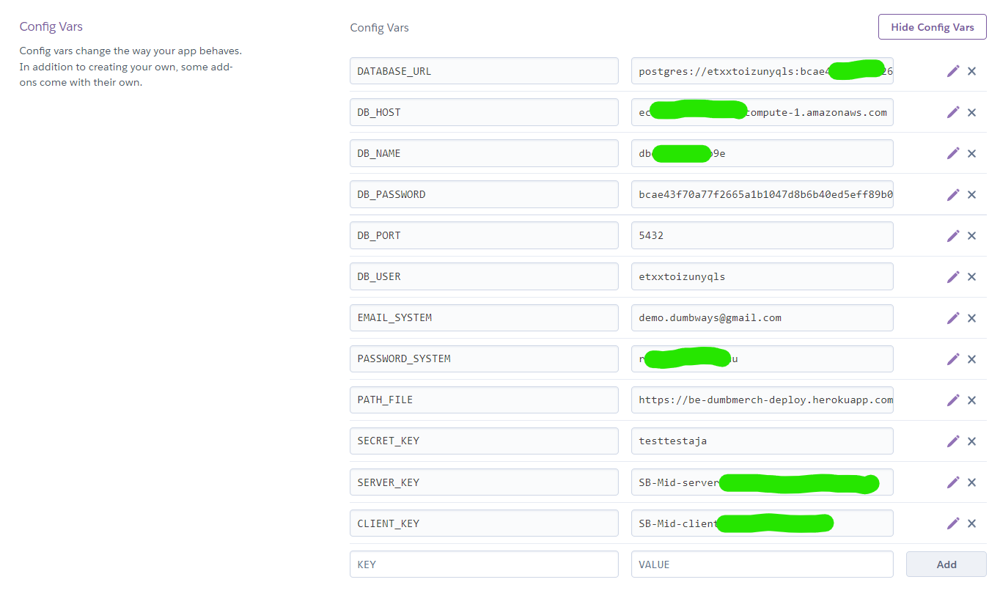
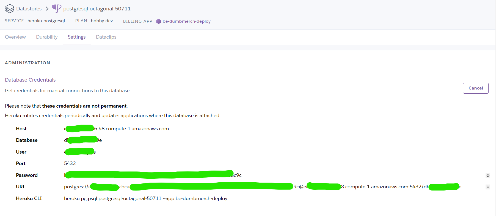

# Deploy backend to heroku

`Heroku` is a cloud platform as a service supporting several programming languages. One of the first cloud platforms, Heroku has been in development since June 2007, when it supported only the Ruby programming language, but now supports Java, Node.js, Scala, Clojure, Python, PHP, and `Go`.

- Install postgres

  ```go
  go get -u gorm.io/driver/postgres
  ```

- Modify connection database with `env` and `postgres`

  > File: `pkg/mysql/mysql.go`

  - Import postgres package

    ```go
    "gorm.io/driver/postgres"
    ```

  - Get `host`, `user`, `password`, `database name`, and `port` from env

    ```go
    var DB_HOST = os.Getenv("DB_HOST")
    var DB_USER = os.Getenv("DB_USER")
    var DB_PASSWORD = os.Getenv("DB_PASSWORD")
    var DB_NAME = os.Getenv("DB_NAME")
    var DB_PORT = os.Getenv("DB_PORT")
    ```

  - Setup Database connection

    ```go
    dsn := fmt.Sprintf("host=%s user=%s password=%s dbname=%s port=%s", DB_HOST, DB_USER, DB_PASSWORD, DB_NAME, DB_PORT)
    DB, err = gorm.Open(postgres.Open(dsn), &gorm.Config{})
    ```

* Modify the server port from env

  > File: `main.go`

  ```javascript
  var port = os.Getenv("PORT");
  ```

* Go to Heroku web : [Link](https://www.heroku.com/) & Create new app

* Fill out the form → click `Create app`

* Go to Resources → add `Heroku Postgress` on Add-ons

* Create repository on github & push restAPI project

* On heroku, Go to `Deploy` → Search repository & click `connect`

* Scroll down, click `Enable Automatic Deploys`, Choose a branch & click `Deploy Branch`

* Go to `Settings`, scroll down to `Config Vars`, Add the `config vars` from dotenv file

  

  | VARIABLE        | VALUE                                                            |
  | --------------- | ---------------------------------------------------------------- |
  | PATH_FILE       | https://<backend_domain>/uploads/                                |
  | SECRET_KEY      | bebas apa saja ...                                               |
  | SERVER_KEY      | SB-Mid-server-fJxxxxxxxxxxxxxxxxxxx3                             |
  | CLIENT_KEY      | SB-Mid-client-YUxxxxxxxxxxxxxMS                                  |
  | EMAIL_SYSTEM    | demo.dumbways@gmail.com                                          |
  | PASSWORD_SYSTEM | rqxxxxxxxxxxxuu                                                  |
  | DB_HOST         | exx-xx-xx-xxx-xx.compute-1.amazonaws.com                         |
  | DB_NAME         | dboxxxxxxxb9e                                                    |
  | DB_PASSWORD     | bxxxxxxxxxxxxxxxxxxxxxxxxxxxxxxxxxxxxxxxxxxxxxxxxxxxxxxxxxxxxxxc |
  | DB_PORT         | 5432                                                             |
  | DB_USER         | etxxxxxxxxxls                                                    |

* Get Database Connection Setup from `Resources` &rarr; `Heroku Postgres` &rarr; `Settings` &rarr; `View Credentials`

  

* Then to ensure our Backend is deployed, we can click `Open App`

# Deploy frontend to netlify

`Netlify` is a San Francisco-based cloud computing company that offers hosting and serverless backend or frontend services for web applications and static websites.

- First Modify `Midtrans Client Key` and config `baseUrl` from ENV

  - Midtrans Client Key

    > File: `src/pages/DetailProduct.js`

    ```javascript
    const myMidtransClientKey = process.env.REACT_APP_MIDTRANS_CLIENT_KEY;
    ```

  - Config `baseUrl`

    > File: `src/config/api.js`

    ```javascript
    {
        baseURL: process.env.REACT_APP_BASEURL,
    }
    ```

- Create repository & push frontend project

- Go to [Netlify](http://netlify.com) → Login → Click `New site from Git`

* Connect to Git provider, click `Github`

* Pick a repository

* Site settings, and deploy

* Scroll down, modify Build command to `CI= npm run build`. Click `Show advanced`

* Click `New variable` for add `environment variables`

  | VARIABLE                      | VALUE                            |
  | ----------------------------- | -------------------------------- |
  | REACT_APP_MIDTRANS_CLIENT_KEY | SB-Mid-client-YUxxxxxxxxxxxxxMS  |
  | REACT_APP_BASEURL             | https://<backend_domain>/api/v1/ |

- Click `Deploy site`

- Wait deploy progress

- Click the link for open web
